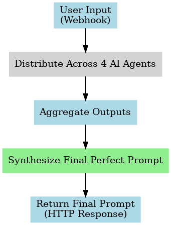

# Perfect Prompts: AI Agent Collaboration and Workflow Automation with n8n

> **Project Pitch:**  
> I built a smart n8n workflow that combines multiple AI agents to transform vague user inputs into highly structured prompts using the RISEN framework.  
> It distributes tasks across different specialized LLMs, aggregates the results, and generates one "Perfect Prompt" ready for complex AI tasks.  
> It shows how AI collaboration and workflow orchestration can create much stronger, business-ready outputs — not just single-model answers.

---

## System Diagram

## What it does
- Receives user input through a webhook
- Distributes the input across four specialized AI agents (each focused on a different skill set)
- Aggregates their outputs intelligently
- Synthesizes a final "Perfect Prompt" ready for high-quality AI tasks

## Technologies Used
- n8n (workflow orchestration)
- LangChain nodes for agent management
- OpenRouter LLMs (Gemini, DeepSeek, Phi-3, Dolphin)
- RISEN framework for prompt refinement
- JSON merging and aggregation logic

## Files
- **perfect-prompts-n8n-workflow.json** — the exported n8n workflow file

## Why this matters
This project demonstrates how multiple AI models can collaborate to enhance user instructions, leading to more precise and effective AI interactions.  
It highlights real-world skills in building smart, modular AI pipelines ready for production environments.

---
---

## Future Work

- Add automatic prompt evaluation scoring (clarity, completeness, and specificity)
- Expand agent specialization (e.g., create agents focused on creative writing, technical documentation, or customer support)
- Integrate optional feedback loop where users rate the generated prompts for continuous model improvement
- Deploy as a public-facing API endpoint to allow external apps to generate structured prompts dynamically
- Enable user feedback collection for looped learning

*Demo built for AI Agent Implementation Manager portfolio presentation.*
